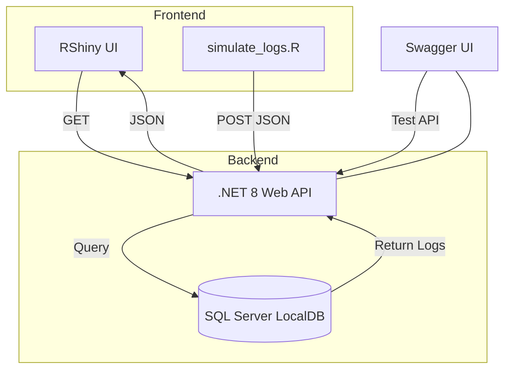

# 📡 LogWaveMonitor

A full-stack, AI-assisted log monitoring system that combines a C# Web API backend with a sleek, real-time RShiny frontend. Designed to help developers, analysts, and solutions architects visualize and track system events in real time, with zero manual database interaction.

---

## 📚 Table of Contents

* [✅ Project Summary](#-project-summary)
* [🧱 Folder Structure](#-folder-structure)
* [⚙️ Tech Stack & Tools](#️-tech-stack--tools)
* [🧭 Step-by-Step Setup](#-step-by-step-setup)
* [📦 R Code Samples](#-r-code-samples)
* [🧾 C# Backend Source Code](#-c-backend-source-code)
* [🔁 Mermaid Diagram](#-mermaid-diagram)
* [🌟 Features](#-features)
* [🧠 Why This Matters](#-why-this-matters)
* [📎 Credits & Attribution](#-credits--attribution)
* [🏷️ Hashtags](#️-hashtags)

---

## ✅ Project Summary

**LogWaveMonitor** was built to simulate and display live event logs as real-time signal waves. It includes:

* A `.NET 8` Web API backend for ingesting log data
* A `SQL Server LocalDB` database for persistent storage
* A `Swagger` UI for live API testing
* An `RShiny` frontend to display logs as animated signal graphs
* A `simulate_logs.R` script for auto-generating system events

This solution was built by a career-transitioning technologist using **AI engineering prompts** to streamline development. It’s a showcase of how low-code solutions and modern tooling can work together.

---

## ⚙️ Tech Stack & Tools

### 💻 Languages & Frameworks


### 🛠 Tooling


### 📦 R Packages


---

## 📦 R Code Samples

### `app.R`

```r
[library(shiny)
library(httr)
library(jsonlite)
library(ggplot2)
library(dplyr)
library(lubridate)
library(DT)

# API endpoint
api_url <- "http://localhost:5008/api/logs"

ui <- fluidPage(
  tags$head(
    tags$style(HTML("
      body {
        background-color: #121212;
        color: #ffffff;
      }
      h1, h2, h3, h4, h5, h6, label, .shiny-input-container {
        color: #ffffff;
      }
      .radio-wave-plot {
        background-color: #000000;
        border: 1px solid #333;
        padding: 10px;
        border-radius: 8px;
      }
      .dataTables_wrapper {
        color: #ffffff;
      }
      table.dataTable td, table.dataTable th {
        color: #ffffff !important;
        background-color: #121212 !important;
      }
    "))
  ),
  titlePanel("📡 LogWave Monitor - Live Log Signal"),
  mainPanel(
    tags$div(
      class = "radio-wave-plot",
      plotOutput("wavePlot", height = "500px")
    ),
    br(),
    DTOutput("logTable")
  )
)

server <- function(input, output, session) {
  # Fetch logs every 5 seconds
  logs <- reactivePoll(5000, session,
                       checkFunc = function() Sys.time(),
                       valueFunc = function() {
                         res <- GET(api_url)
                         if (status_code(res) == 200) {
                           content(res, "parsed", simplifyVector = TRUE)
                         } else {
                           data.frame()
                         }
                       }
  )
  
  output$wavePlot <- renderPlot({
    df <- logs()
    if (nrow(df) == 0) return(NULL)
    
    df$timestamp <- ymd_hms(df$timestamp)
    
    ggplot(df, aes(x = timestamp, y = as.numeric(as.factor(eventLevel)), color = eventLevel)) +
      geom_line(linewidth = 1.3, show.legend = TRUE) +
      geom_point(size = 2) +
      theme_minimal(base_size = 14) +
      theme(
        plot.background = element_rect(fill = "black"),
        panel.background = element_rect(fill = "black"),
        axis.text = element_text(color = "white"),
        axis.title = element_text(color = "white"),
        plot.title = element_text(color = "white"),
        plot.subtitle = element_text(color = "white"),
        legend.title = element_text(color = "white"),
        legend.text = element_text(color = "white")
      ) +
      labs(
        x = "Timestamp",
        y = "Signal Level",
        title = "Log Events (Signal Visualization)",
        subtitle = "Color = Log Severity"
      )
  })
  
  output$logTable <- renderDT({
    df <- logs()
    datatable(df, options = list(pageLength = 10), class = "display nowrap compact cell-border stripe")
  })
}

shinyApp(ui, server)
]
```

### `simulate_logs.R`

```r
[library(httr)
library(jsonlite)

set.seed(Sys.time())

eventLevels <- c("INFO", "WARNING", "ERROR")
messages <- c(
  "CPU temperature rising",
  "Heartbeat detected",
  "Unexpected delay in service X",
  "System cache flushed",
  "Disk I/O spike detected",
  "Security token refreshed",
  "Minor GC pause",
  "Unhandled exception caught"
)

while (TRUE) {
  log_entry <- list(
    timestamp = format(Sys.time(), "%Y-%m-%dT%H:%M:%SZ"),
    eventLevel = sample(eventLevels, 1, prob = c(0.6, 0.3, 0.1)),
    message = sample(messages, 1)
  )
  
  res <- POST(
    url = "http://localhost:5008/api/logs",
    body = toJSON(log_entry, auto_unbox = TRUE),
    encode = "raw",  # Send raw JSON
    add_headers(`Content-Type` = "application/json")  # Tell the API it's JSON
  )
  
  print(paste("Status", status_code(res), "→", log_entry$message))
  
  Sys.sleep(runif(1, 3, 7))  # Sleep 3–7 seconds between logs
}
]
```

---

## 🧾 C# Backend Source Code

### `Models/LogEvent.cs`

```csharp
[namespace LogWaveApi.Models
{
    public class LogEvent
    {
        public int Id { get; set; }
        public DateTime Timestamp { get; set; }
        public string EventLevel { get; set; }
        public string Message { get; set; }
    }
}]
```

### `Data/LogWaveContext.cs`

```csharp
[using Microsoft.EntityFrameworkCore;
using LogWaveApi.Models;

namespace LogWaveApi.Data
{
    public class LogWaveContext : DbContext
    {
        public LogWaveContext(DbContextOptions<LogWaveContext> options) : base(options) { }

        public DbSet<LogEvent> LogEvents { get; set; }
    }
}]
```

### `Controllers/LogEventsController.cs`

```csharp
[using Microsoft.AspNetCore.Mvc;
using Microsoft.EntityFrameworkCore;
using LogWaveApi.Data;
using LogWaveApi.Models;

namespace LogWaveApi.Controllers
{
    [ApiController]
    [Route("api/logs")]
    public class LogEventsController : ControllerBase
    {
        private readonly LogWaveContext _ctx;

        public LogEventsController(LogWaveContext ctx)
        {
            _ctx = ctx;
        }

        [HttpPost]
        public async Task<IActionResult> Ingest([FromBody] LogEvent le)
        {
            _ctx.LogEvents.Add(le);
            await _ctx.SaveChangesAsync();
            return Ok(le);
        }

        [HttpGet]
        public async Task<IActionResult> GetAll()
        {
            return Ok(await _ctx.LogEvents.OrderBy(l => l.Timestamp).ToListAsync());
        }
    }
}]
```

### `Program.cs`

```csharp
[using Microsoft.EntityFrameworkCore;
using LogWaveApi.Data;

var builder = WebApplication.CreateBuilder(args);

builder.Services.AddControllers();
builder.Services.AddEndpointsApiExplorer();
builder.Services.AddSwaggerGen();

builder.Services.AddDbContext<LogWaveContext>(options =>
    options.UseSqlServer(builder.Configuration.GetConnectionString("DefaultConnection")));

var app = builder.Build();

if (app.Environment.IsDevelopment())
{
    app.UseSwagger();
    app.UseSwaggerUI();
}

app.UseAuthorization();
app.MapControllers();
app.Run();]
```

---

## 🔁 Mermaid Diagram



    
## 🧠 Why This Matters

This project is more than just a tech demo—it represents how AI can empower both emerging and experienced developers to:

* Rapidly prototype full-stack solutions using low-code techniques
* Integrate R, SQL Server, Swagger, and .NET in real-world observability workflows
* Create stunning UIs and robust APIs even with limited front-end experience
* Highlight cross-functional architecture skills for job interviews, portfolios, or certifications

It’s also a valuable learning path for:

* Career switchers moving into tech roles
* Analysts expanding into software development
* Veterans or professionals re-entering the job market

Whether you're deploying to the cloud or debugging on localhost, **LogWaveMonitor** proves how accessible and scalable modern DevOps can be—with a little help from AI.

---

## 📎 Credits & Attribution

* ✍️ Written and built by a U.S. Army Veteran and Solutions Architect in training
* 🤖 Guided by OpenAI GPT-4o (AI engineering prompts)
* 👨🏾‍💻 For developers who want to survive and thrive in today’s job market

---

## 🏷️ Hashtags


